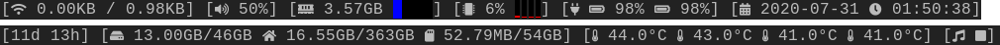

# DWM Statusbar

## Description

A simple statusbar for dwm (6.2) without using external commands.

Dependencies:
- ttf-font-awesome
- https://github.com/sqp/pulseaudio (to communicate with the pulseaudio daemon)
- https://github.com/BurntSushi/xgb (to avoid using xsetroot as external command)

Example output (there are more colors in use depending on the sensor levels):

## Install

Since we use colors, draw stuff and use two bars we need the `dwm-status2d-extrabar-6.2.diff` is required: https://dwm.suckless.org/patches/status2d/

## Config

Outputs are configured in `statusbar.go` with refresh interval in miliseconds. The interval is passed to the component function. There is an additional `baseInterval` which limits the update rate of the bar.

Copy the `config.def.go` in the components folder to `config.go` and remove the first line.

|Module|Setting|Value|
|---|---|---|
|thermal|hwmons|comma-separated list of hwmon names found in `/sys/class/hwmon/hwmon*/name` All available inputs are used|
|pulseaudio|device|`pacmd list-sinks | grep 'name:'`|
|pulseaudio|headphonePort|`pacmd list-sinks | grep ports -A 20`. Most likely `analog-output-headphones`|
|pulseaudio|sinkPath|`pacmd list-sinks | grep 'index:'` /org/pulseaudio/core1/sink`X`|
|network|wired|ethernet interface name|
|network|wireless|wireless interface name|
|mpd|socket|path to the mpd socket|
|filesystem|root|path of root directory|
|filesystem|home|path of home directory|
|filesystem|sdcard|path of sdcard directory (you probably don't need this)|
